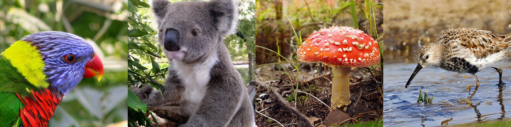
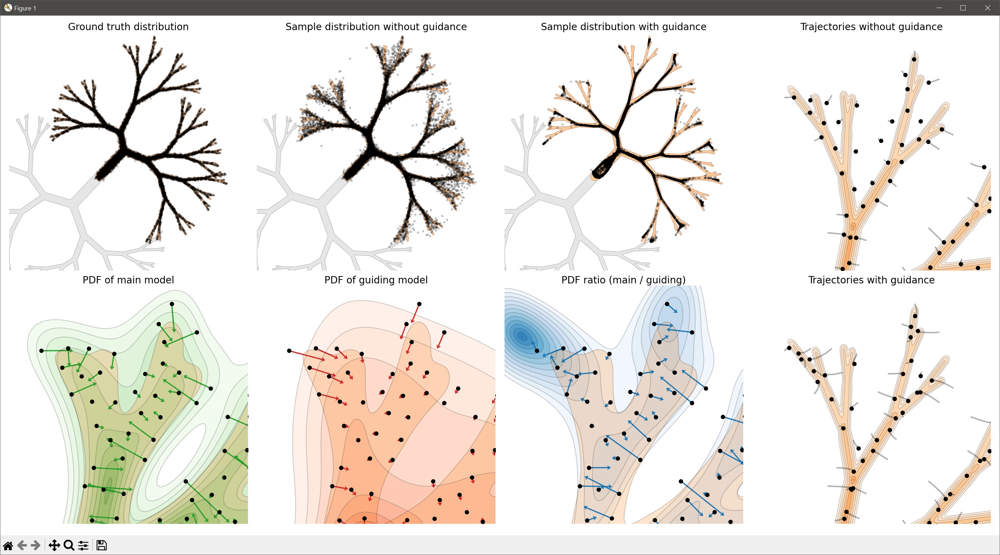

## EDM2 and Autoguidance &mdash; Official PyTorch implementation



**Analyzing and Improving the Training Dynamics of Diffusion Models** (CVPR 2024 oral)<br>
Tero Karras, Miika Aittala, Jaakko Lehtinen, Janne Hellsten, Timo Aila, Samuli Laine<br>
https://arxiv.org/abs/2312.02696<br>

**Guiding a Diffusion Model with a Bad Version of Itself** (NeurIPS 2024 oral)<br>
Tero Karras, Miika Aittala, Tuomas Kynk&auml;&auml;nniemi, Jaakko Lehtinen, Timo Aila, Samuli Laine<br>
https://arxiv.org/abs/2406.02507<br>

For business inquiries, please visit our website and submit the form: [NVIDIA Research Licensing](https://www.nvidia.com/en-us/research/inquiries/)

## Requirements

* Linux and Windows are supported, but we recommend Linux for performance and compatibility reasons.
* 1+ high-end NVIDIA GPU for sampling and 8+ GPUs for training. We have done all testing and development using V100 and A100 GPUs.
* 64-bit Python 3.9 and PyTorch 2.1 (or later). See https://pytorch.org for PyTorch install instructions.
* Other Python libraries: `pip install click Pillow psutil requests scipy tqdm diffusers==0.26.3 accelerate==0.27.2`
* For downloading the raw snapshots needed for post-hoc EMA reconstruction, we recommend using [Rclone](https://rclone.org/install/).

For convenience, we provide a [Dockerfile](./Dockerfile) with the required dependencies. You can use it as follows:

```.bash
# Build Docker image
docker build --tag edm2:latest .

# Run generate_images.py using Docker
docker run --gpus all -it --rm --user $(id -u):$(id -g) \
    -v `pwd`:/scratch --workdir /scratch -e HOME=/scratch \
    edm2:latest \
    python generate_images.py --preset=edm2-img512-s-guid-dino --outdir=out
```

If you hit an error, please ensure you have correctly installed the [NVIDIA container runtime](https://docs.docker.com/config/containers/resource_constraints/#gpu). See [NVIDIA PyTorch container release notes](https://docs.nvidia.com/deeplearning/frameworks/pytorch-release-notes/rel-24-02.html#rel-24-02) for driver compatibility details.

Breakdown of the `docker run` command line:

- `--gpus all -it --rm --user $(id -u):$(id -g)`: With all GPUs enabled, run an interactive session with current user's UID/GID to avoid Docker writing files as root.
- ``-v `pwd`:/scratch --workdir /scratch``: Mount current running dir (e.g., the top of this git repo on your host machine) to `/scratch` in the container and use that as the current working dir.
- `-e HOME=/scratch`: Specify where to cache temporary files. If you want more fine-grained control, you can instead set `DNNLIB_CACHE_DIR` (for pre-trained model download cache). You want these cache dirs to reside on persistent volumes so that their contents are retained across multiple `docker run` invocations.

## Using pre-trained models

We provide pre-trained models for our proposed EDM2 configuration (config G) for different model sizes trained with ImageNet-512 and ImageNet-64. To generate images using a given model, run:

```.bash
# Generate a couple of images and save them as out/*.png
python generate_images.py --preset=edm2-img512-s-guid-dino --outdir=out
```

The above command automatically downloads the necessary models and caches them under `$HOME/.cache/dnnlib`, which can be overridden by setting the `DNNLIB_CACHE_DIR` environment variable. The `--preset=edm2-img512-s-guid-dino` option indicates that we will be using the S-sized EDM2 model, trained with ImageNet-512 and sampled using guidance, with EMA length and guidance strength chosen to minimize FD<sub>DINOv2</sub>. The following presets are supported:

```
# EDM2 paper
edm2-img512-{xs|s|m|l|xl|xxl}-fid              # Table 2, minimize fid
edm2-img512-{xs|s|m|l|xl|xxl}-dino             # Table 5, minimize fd_dinov2
edm2-img64-{s|m|l|xl}-fid                      # Table 3, minimize fid
edm2-img512-{xs|s|m|l|xl|xxl}-guid-{fid|dino}  # Table 2, classifier-free guidance

# Autoguidance paper
edm2-img512-{s|xxl}-autog-{fid|dino}           # Table 1, conditional ImageNet-512
edm2-img512-s-uncond-autog-{fid|dino}          # Table 1, unconditional ImageNet-512
edm2-img64-s-autog-{fid|dino}                  # Table 1, conditional ImageNet-64
```

Each of these maps to a specific set of options that point to the models in [https://nvlabs-fi-cdn.nvidia.com/edm2/posthoc-reconstructions/](https://nvlabs-fi-cdn.nvidia.com/edm2/posthoc-reconstructions/). For example, `--preset=edm2-img512-xxl-guid-dino` is equivalent to:

```.bash
# Expanded command line for --preset=edm2-img512-xxl-guid-dino
python generate_images.py \
    --net=https://nvlabs-fi-cdn.nvidia.com/edm2/posthoc-reconstructions/edm2-img512-xxl-0939524-0.015.pkl \
    --gnet=https://nvlabs-fi-cdn.nvidia.com/edm2/posthoc-reconstructions/edm2-img512-xs-uncond-2147483-0.015.pkl \
    --guidance=1.7 \
    --outdir=out
```

In other words, we will use the XXL-sized conditional model at 939524 kimg and EMA length 0.015, and guide it with respect to the XS-sized unconditional model at 2147483 kimg with guidance strength 1.7. For further details, see `config_presets` in [`generate_images.py`](./generate_images.py).

## Calculating FLOPs and metrics

The computational cost of a given model can be estimated using `count_flops.py`:

```.bash
# Calculate FLOPs for a given model
python count_flops.py \
    https://nvlabs-fi-cdn.nvidia.com/edm2/posthoc-reconstructions/edm2-img512-s-2147483-0.130.pkl
```

To calculate FID and FD<sub>DINOv2</sub>, we first need to generate 50,000 random images. This can be quite time-consuming in practice, so it makes sense to distribute the workload across multiple GPUs. This can be done by launching `generate_images.py` through `torchrun`:

```.bash
# Generate 50000 images using 8 GPUs and save them as out/*/*.png
torchrun --standalone --nproc_per_node=8 generate_images.py \
    --preset=edm2-img512-s-guid-fid --outdir=out --subdirs --seeds=0-49999
```

Alternatively, `generate_images.py` can be launched as a multi-GPU or multi-node job in a compute cluster. This should work out-of-the-box as long as the cluster environment spawns a separate process for each GPU and populates the necessary environment variables. For further details, please refer to the [`torchrun`](https://pytorch.org/docs/stable/elastic/run.html) documetation.

Having generated 50,000 images, FID and FD<sub>DINOv2</sub> can then be calculated using `calculate_metrics.py`:

```.bash
# Calculate metrics for a random subset of 50000 images in out/
python calculate_metrics.py calc --images=out \
    --ref=https://nvlabs-fi-cdn.nvidia.com/edm2/dataset-refs/img512.pkl
```

Here, the `--ref` option points to pre-computed reference statistics for the dataset that the model was originally trained with. The necessary reference statistics for our pre-trained models are available at [https://nvlabs-fi-cdn.nvidia.com/edm2/dataset-refs/](https://nvlabs-fi-cdn.nvidia.com/edm2/dataset-refs/).

Note that the numerical values of the metrics vary across different random seeds and are highly sensitive to the number of images. By default, `calculate_metrics.py` uses 50,000 generated images, in line with established best practices. Providing fewer images will result in an error, whereas providing more will use a random subset. To reduce the effect of random variation, we recommend repeating the calculation multiple times with different random seeds, e.g., `--seeds=0-49999`, `--seeds=50000-99999`, and `--seeds=100000-149999`. In our paper, we calculated each metric multiple times and reported the minimum.

When performing larger sweeps over, say, EMA lengths or training snapshots, it may be impractical to use `generate_images.py` as outlined above. As an alternative, the metrics can also be calculated directly for a given network pickle, generating the necessary images on the fly:

```.bash
# Calculate metrics directly for a given model without saving any images
torchrun --standalone --nproc_per_node=8 calculate_metrics.py gen \
    --net=https://nvlabs-fi-cdn.nvidia.com/edm2/posthoc-reconstructions/edm2-img512-s-2147483-0.130.pkl \
    --ref=https://nvlabs-fi-cdn.nvidia.com/edm2/dataset-refs/img512.pkl \
    --seed=123456789
```

We also provide the necessary APIs to do these kinds of operations programmatically from external Python scripts. For further details, see `gen()` in [`calculate_metrics.py`](./calculate_metrics.py).

## Post-hoc EMA reconstruction

The models in [https://nvlabs-fi-cdn.nvidia.com/edm2/posthoc-reconstructions/](https://nvlabs-fi-cdn.nvidia.com/edm2/posthoc-reconstructions/) correspond to specific choices for the EMA length. In addition, we also provide the raw snapshots for each training run in [https://nvlabs-fi-cdn.nvidia.com/edm2/raw-snapshots/](https://nvlabs-fi-cdn.nvidia.com/edm2/raw-snapshots/) that can be used to reconstruct arbitrary EMA profiles.

Note that the raw snapshots can take up a considerable amount of disk space. In the paper, we saved snapshots every 8Mi (= 8 [mebi](https://en.wikipedia.org/wiki/Binary_prefix#mebi) = 8&times;2<sup>20</sup>) training images, corresponding to 118&ndash;635 GB of data per training run depending on model size. In [https://nvlabs-fi-cdn.nvidia.com/edm2/raw-snapshots/](https://nvlabs-fi-cdn.nvidia.com/edm2/raw-snapshots/), we provide the snapshots at 32Mi intervals instead, corresponding to 30&ndash;159 GB per training run. We have done extensive testing to verify that this is sufficient for accurate reconstruction.

To reconstruct new EMA profiles, the first step is to download the raw snapshots corresponding to a given training run. We recommend using [Rclone](https://rclone.org/install/) for this:

```.bash
# Download raw snapshots for the pre-trained edm2-img512-xs model
rclone copy --progress --http-url https://nvlabs-fi-cdn.nvidia.com/edm2 \
    :http:raw-snapshots/edm2-img512-xs/ raw-snapshots/edm2-img512-xs/
```

The above command downloads 128 network pickles, 238 MB each, yielding 29.8 GB in total. Once the download is complete, new EMA profiles can be reconstructed using `reconstruct_phema.py`:

```.bash
# Reconstruct a new EMA profile with std=0.150
python reconstruct_phema.py --indir=raw-snapshots/edm2-img512-xs \
    --outdir=out --outstd=0.150
```

This reads each of the input pickles once and saves the reconstructed model at `out/phema-2147483-0.150.pkl`, to be used with, e.g., `generate_images.py`. To perform a sweep over EMA length, it is also possible reconstruct multiple EMA profiles simultaneously:

```.bash
# Reconstruct a set of 31 EMA profiles, streaming over the input data 4 times
python reconstruct_phema.py --indir=raw-snapshots/edm2-img512-xs \
    --outdir=out --outstd=0.010,0.015,...,0.250 --batch=8
```

See [`python reconstruct_phema.py --help`](./docs/phema-help.txt) for the full list of options.

Note that our post-hoc EMA approach is not specific to diffusion models in any way &mdash; it can be applied to other kinds of deep learning models as well. To try it out in your own training runs, you can **(1)** include [`training/phema.py`](./training/phema.py) in your codebase, **(2)** modify your training loop to use `phema.PowerFunctionEMA`, and **(3)** take a copy of [`reconstruct_phema.py`](./reconstruct_phema.py) and modify it to suit your needs.

## Preparing datasets

Datasets are stored as uncompressed ZIP archives containing uncompressed PNG or NPY files, along with a metadata file `dataset.json` for labels. When using latent diffusion, it is necessary to create two different versions of a given dataset: the original RGB version, used for evaluation, and a VAE-encoded latent version, used for training.

To set up ImageNet-512:

1. Download the ILSVRC2012 data archive from [Kaggle](https://www.kaggle.com/competitions/imagenet-object-localization-challenge/data) and extract it somewhere, e.g., `downloads/imagenet`.

2. Crop and resize the images to create the original RGB dataset:

```.bash
# Convert raw ImageNet data to a ZIP archive at 512x512 resolution
python dataset_tool.py convert --source=downloads/imagenet/ILSVRC/Data/CLS-LOC/train \
    --dest=datasets/img512.zip --resolution=512x512 --transform=center-crop-dhariwal
```

3. Run the images through a pre-trained VAE encoder to create the corresponding latent dataset:

```.bash
# Convert the pixel data to VAE latents
python dataset_tool.py encode --source=datasets/img512.zip \
    --dest=datasets/img512-sd.zip
```

4. Calculate reference statistics for the original RGB dataset, to be used with `calculate_metrics.py`:

```.bash
# Compute dataset reference statistics for calculating metrics
python calculate_metrics.py ref --data=datasets/img512.zip \
    --dest=dataset-refs/img512.pkl
```

## Training new models

New models can be trained using `train_edm2.py`. For example, to train an XS-sized conditional model for ImageNet-512 using the same hyperparameters as in our paper, run:

```.bash
# Train XS-sized model for ImageNet-512 using 8 GPUs
torchrun --standalone --nproc_per_node=8 train_edm2.py \
    --outdir=training-runs/00000-edm2-img512-xs \
    --data=datasets/img512-sd.zip \
    --preset=edm2-img512-xs \
    --batch-gpu=32
```

This example performs single-node training using 8 GPUs, but in practice, we recommend using at least 32 A100 GPUs, i.e., 4 DGX nodes. Note that training large models may easily run out of GPU memory, depending on the number of GPUs and the available VRAM. The best way to avoid this is to limit the per-GPU batch size using gradient accumulation. In the above example, the total batch size is 2048 images, i.e., 256 per GPU, but we limit it to 32 per GPU by specifying `--batch-gpu=32`. Modifying `--batch-gpu` is safe in the sense that it has no interaction with the other hyperparameters, whereas modifying the total batch size would also necessitate adjusting, e.g., the learning rate.

By default, the training script prints status every 128Ki (= 128 [kibi](https://en.wikipedia.org/wiki/Binary_prefix#kibi) = 128&times;2<sup>10</sup>) training images (controlled by `--status`), saves network snapshots every 8Mi (= 8&times;2<sup>20</sup>) training images (controlled by `--snapshot`), and dumps training checkpoints every 128Mi training images (controlled by `--checkpoint`). The status is saved in `log.txt` (one-line summary) and `stats.json` (comprehensive set of statistics). The network snapshots are saved in `network-snapshot-*.pkl`, and they can be used directly with, e.g., `generate_images.py` and `reconstruct_phema.py`.

The training checkpoints, saved in `training-state-*.pt`, can be used to resume the training at a later time.
When the training script starts, it will automatically look for the highest-numbered checkpoint and load it if available. To resume training, simply run the same `train_edm2.py` command line again &mdash; it is important to use the same set of options to avoid accidentally changing the hyperparameters mid-training. If you wish to have the ability to suspend the training at any time so that no progress is lost, you can modify the `should_suspend()` function in [torch_utils/distributed.py](./torch_utils/distributed.py) to implement the desired signaling protocol.

See [`python train_edm2.py --help`](./docs/train-help.txt) for the full list of options.

## 2D toy example

The 2D toy example used in the autoguidance paper can be reproduced with `toy_example.py`:

```.bash
# Visualize sampling distributions using autoguidance.
python toy_example.py plot
```

See [`python toy_example.py --help`](./docs/toy-help.txt) for the full list of options.



## License

Copyright &copy; 2024, NVIDIA CORPORATION & AFFILIATES. All rights reserved.

All material, including source code and pre-trained models, is licensed under the [Creative Commons Attribution-NonCommercial-ShareAlike 4.0 International License](http://creativecommons.org/licenses/by-nc-sa/4.0/).

## Citation

```
@inproceedings{Karras2024edm2,
  title     = {Analyzing and Improving the Training Dynamics of Diffusion Models},
  author    = {Tero Karras and Miika Aittala and Jaakko Lehtinen and
               Janne Hellsten and Timo Aila and Samuli Laine},
  booktitle = {Proc. CVPR},
  year      = {2024},
}

@inproceedings{Karras2024autoguidance,
  title     = {Guiding a Diffusion Model with a Bad Version of Itself},
  author    = {Tero Karras and Miika Aittala and Tuomas Kynk\"a\"anniemi and
               Jaakko Lehtinen and Timo Aila and Samuli Laine},
  booktitle = {Proc. NeurIPS},
  year      = {2024},
}
```

## Development

This is a research reference implementation and is treated as a one-time code drop. As such, we do not accept outside code contributions in the form of pull requests.

## Acknowledgments

We thank Eric Chan, Qinsheng Zhang, Erik H&auml;rk&ouml;nen, Arash Vahdat, Ming-Yu Liu, David Luebke, and Alex Keller for discussions and comments, and Tero Kuosmanen and Samuel Klenberg for maintaining our compute infrastructure.
